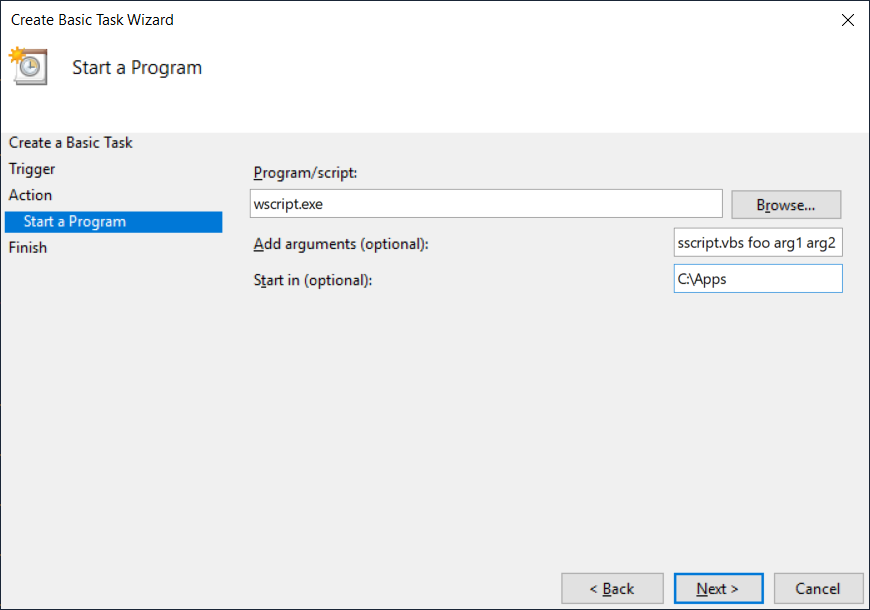

# Silent Start

Silent Start (`sstart.vbs`) is a small [VBScript] program for [Windows
Scripting Host] (specifically [`wscript.exe`][wscript]) designed to launch
another program _silently_, without any visible user interface.

## Problem

If you use the [Windows Task Scheduler] to schedule a console application or a
batch program to run while the user is logged on then you see a console window
appear on the desktop during the execution of the program. The console window
is created by Windows on behalf of the program or the batch. The appearance of
the console window on the desktop on each periodic run can be distracting or
annoying for a user.

## Solution

Windows applications, in contrast to console applications, are responsible for
displaying their own user interface so Windows does not create any window on
behalf of the application. If a Windows application that does not create any
window on being launched is scheduled to run via the Windows Task Scheduler
then no window will appear on the scheduled runs of the task. So the solution
to hiding the console window of a console application or a batch program is to
schedule a _headless_ Windows program instead and have that Windows program
launch the console application or batch program with its initial window
hidden. When one program launches another program in Windows, the launching
program can specify how the initial window of the launched program will
appear.

A Windows application that does not display any window or user interface on
being launched  already exists in Windows! It is `wscript.exe`, the Windows
Scripting Host (WSH). WSH has a [`WshShell`][WshShell] object whose
[`Run`][run] method allows scripts to run other programs:

    object.Run(strCommand, [intWindowStyle], [bWaitOnReturn])

Its `intWindowStyle` argument allows specifying the _style_ with which to
display the initial window of the launched program. A value of zero (0) will
hide it and this is precisely what `sstart.vbs` does!

## Usage

    wscript sstart.vbs PROGRAM ARGS...

where `PROGRAM` is the path to the program to launch hidden and `ARGS...` is
one or more arguments passed to the launched program.

For the purpose it is designed, `sstart.vbs` should be launched with
`wscript.exe`.

The exit code of the launched application or batch program is propagated.

## Usage as a Scheduled Task

The screenshot below shows how to set-up a task in the Windows Task Scheduler
to be used together with `wscript.exe` and `sscript.vbs`. It assumes that
there exists a directory `C:\Apps` with `sscript.vbs` and a program called
`foo` that takes arguments `arg1` followed by `arg2`:

## Testing

There is a PowerShell script in the repository called `test.ps1` that can be
used to interactively test any program with `sstart.vbs`.

    test.ps1 [[-Program] <string>] [[-ArgumentList] <string[]>] [<CommonParameters>]

It has the same logical usage as the VBScript script:

    .\test.ps1 PROGRAM ARGS...

Use the `-Verbose` switch to display the exit code.

Examples of how to test:

    PS> .\test.ps1 -Verbose $env:ComSpec /c dir $env:SystemRoot
    VERBOSE: ExitCode = 0
    PS> .\test.ps1 -Verbose $env:ComSpec /c dir %rand%
    VERBOSE: ExitCode = 1

[VBScript]: https://docs.microsoft.com/en-us/previous-versions/windows/internet-explorer/ie-developer/scripting-articles/t0aew7h6(v%3dvs.84)
[Windows Scripting Host]: https://docs.microsoft.com/en-us/windows-server/administration/windows-commands/wscript
[wscript]: https://docs.microsoft.com/en-us/windows-server/administration/windows-commands/wscript
[Windows Task Scheduler]: https://docs.microsoft.com/en-us/windows/desktop/taskschd/task-scheduler-start-page
[WshShell]: https://docs.microsoft.com/en-us/previous-versions/windows/internet-explorer/ie-developer/scripting-articles/aew9yb99%28v%3dvs.84%29
[run]: https://docs.microsoft.com/en-us/previous-versions/windows/internet-explorer/ie-developer/scripting-articles/d5fk67ky%28v%3dvs.84%29
